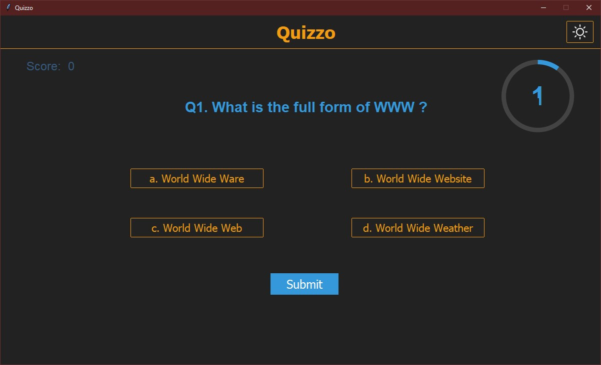
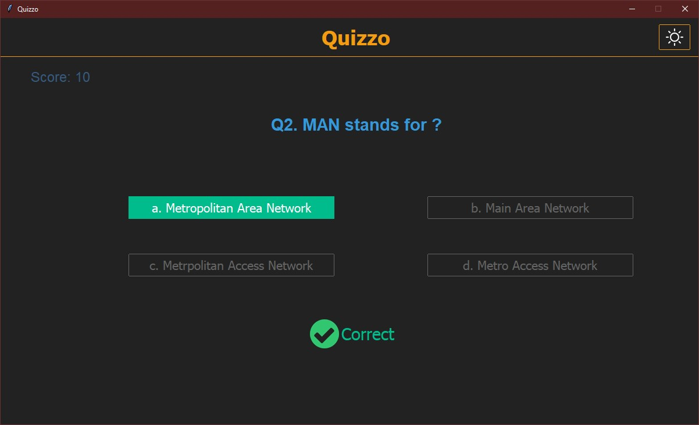
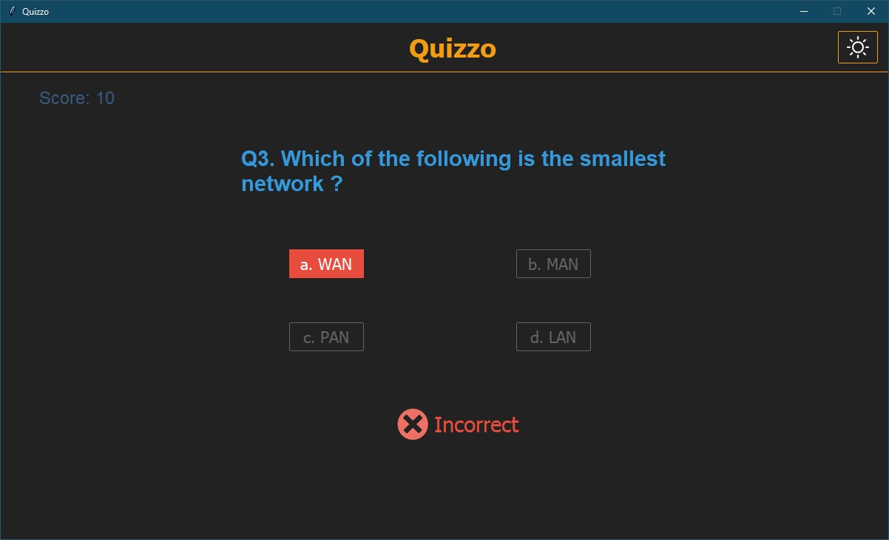
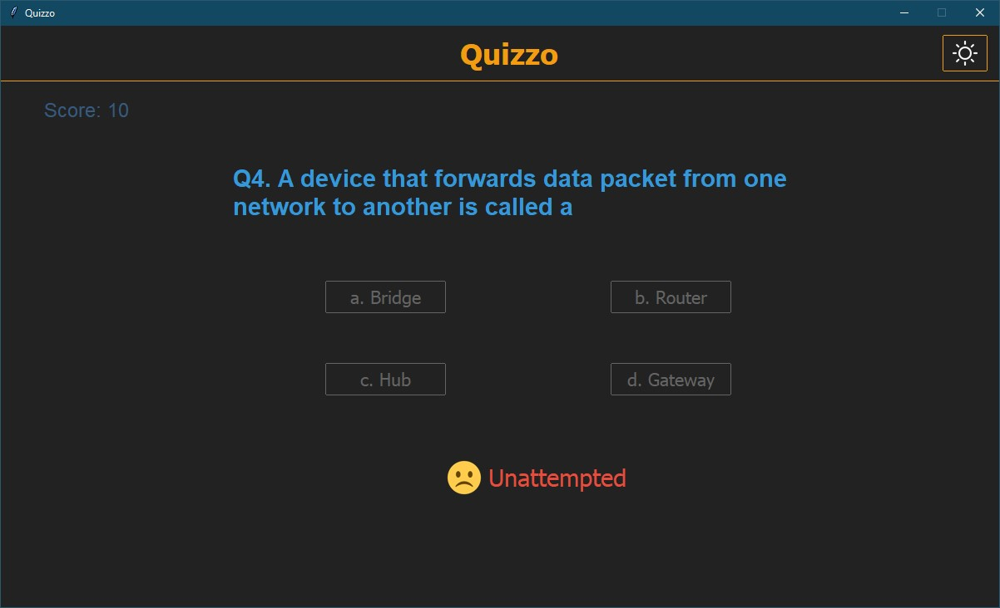
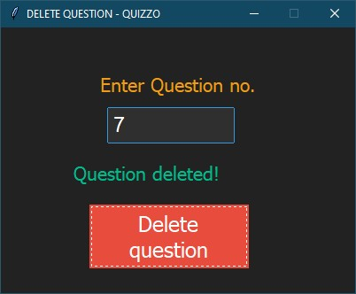

# QUIZZO
A GUI quiz application made in Tkinter (school project).



# Features
1. We can add mcqs
2. We can delete mcqs
3. Each mcq is of 10 seconds, if not selected marked as "Unattempted".
4. Each question has 10 points.
5. We can switch from night mode to day mode and vice-versa.
6. Show all summary After quiz ended.
7. Good for students who want to practice MCQs.

## Requirements
- Python version 3.10 or higher
- MySQL version 8.0

### Modules used
- Pillow (8.4.0)
- mysql-connector (2.2.9)
- ttkbootstrap (1.6.0)

## Setup before run
- Create a mysql database named `"QUIZDB"`
```mysql> CREATE DATABASE QUIZDB;```

- To install required modules run following command in terminal in project folder.
```bash
$ pip install -r requirements.txt
```
- To start, run `__main__.py` file or:
```bash
$ python Quizzo
```
**Quizzo** is the repo name
- Run [database.py](./database.py) to add some example mcqs in the database. And comment line no. 91 after running it.
- Comment below line.
```
    mydb.add_example_mcqs()
```

## Screenshots









